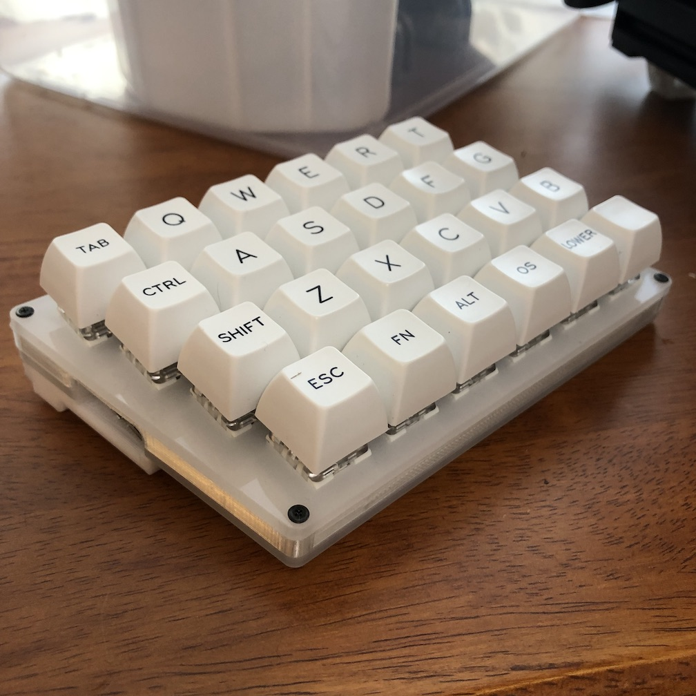
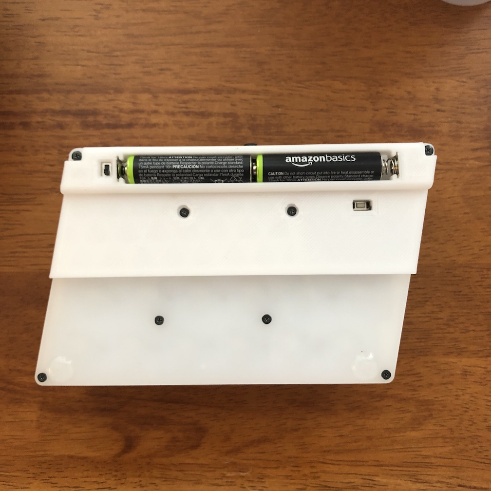
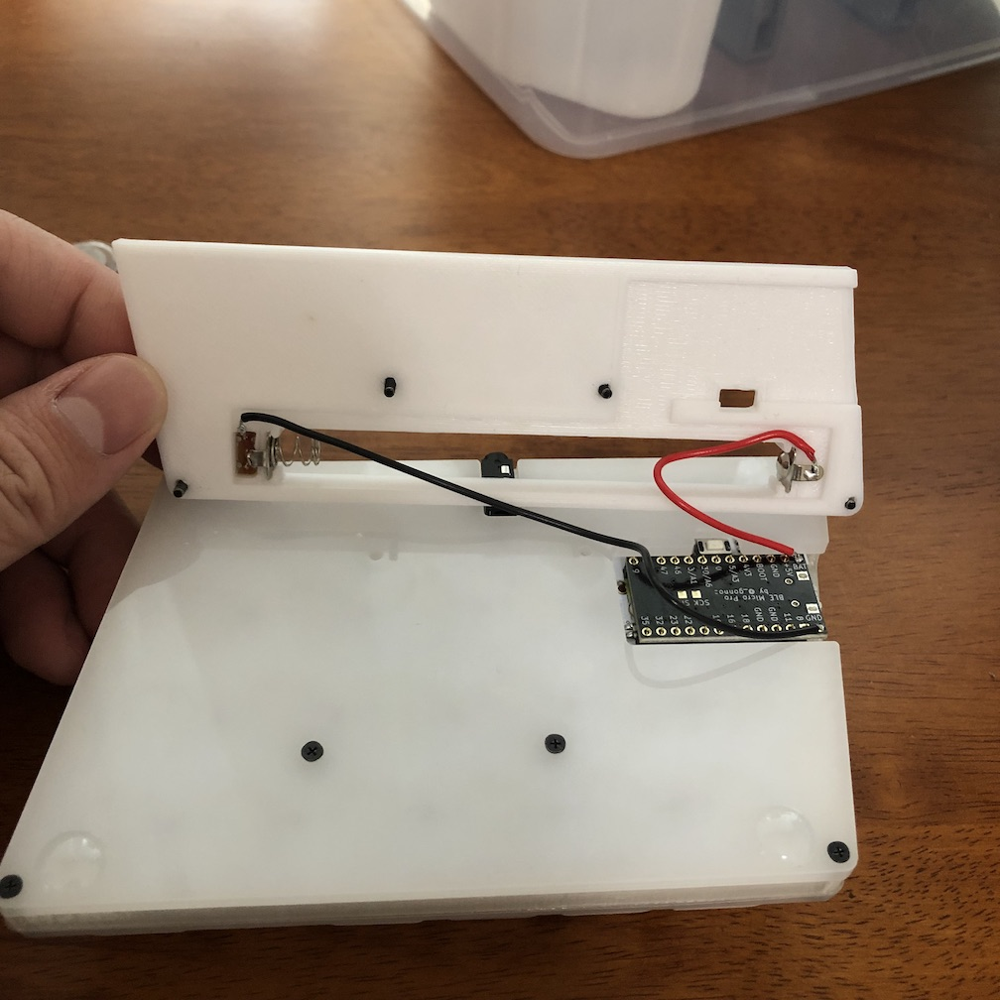

# Battery Case for Zinc

[25KEYS](https://25keys.booth.pm) から販売されている [Zinc キーボード](https://25keys.booth.pm/items/1076720)を [BLE Micro Pro](https://github.com/sekigon-gonnoc/BLE-Micro-Pro) を使って無線化する際に、電源として単四電池を使うためのケースの STL ファイルです。

STL ファイルのソースとして FreeCAD ファイルも添付してありますので、必要に応じて修正してお使いください。

## 必要なアイテム

ケースを使うためには、キーボード、BLE Micro Pro に加え、下記のアイデムが必要になります。ネジは Zinc 付属のネジがそのまま使えるように設計してります。

- 3D プリンター & フィラメント
- スイッチ
- 電池端子
- 線材

今回は、スイッチとして [SS12D00G3](https://amzn.to/2UT0fxh)、電池端子として [uxcell製 電池バネプレート](https://amzn.to/2JaFU4u) を利用しています。使う部材等に応じて、FreeCAD のファイルを修正してお使いください。

## 配線

配線例は、下記の画像を参照してください。プラスとマイナスは逆にしても良いかと思います。

